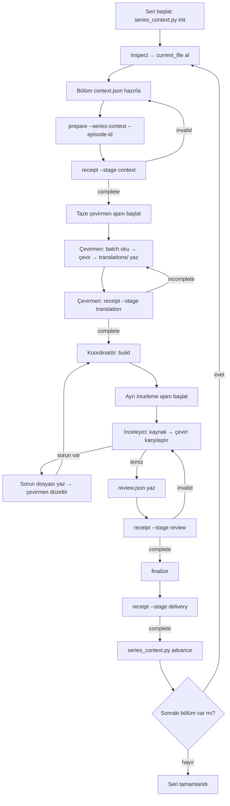

# Tek seri sohbetinde ajan orkestrasyonu

Bu akış alt ajan desteği olan Codex veya eşdeğer bir ortamda kullanılır. Ortak skill uygulamaya özgü ajan API'si çağırmaz; dosya ve makbuz protokolünü tanımlar. Ana koordinatör bir animeyi veya diziyi tek sohbette yürütebilir, fakat altyazı metni yalnız bölüm ajanlarının bağlamına girer.

## Seri bağlamı

Seri işinin başında bir kez oluştur:

```sh
python <skill_dir>/scripts/series_context.py init --series-root <seri>/series-context --series-id <güvenli-kimlik> --title <başlık>
python <skill_dir>/scripts/series_context.py inspect --series-root <seri>/series-context
```

`inspect` yalnız güncel revizyonu, hash'i, kapsanan son bölümü ve kayıt sayılarını döndürür. Terim veya replik döndürmez. `current_file` içindeki değişmez revizyon, bölüm hazırlanırken kullanılır:

```sh
python <skill_dir>/scripts/run_pipeline.py prepare --input <kaynak.ass> --job <bölüm-işi> --context <episode-context.json> --series-context <current_file> --episode-id S01E01
python <skill_dir>/scripts/run_pipeline.py receipt --job <bölüm-işi> --stage context
```

Seri revizyonu yalnız kalıcı sözlük, alias, hitap/ilişki, karakter sesi ve açık belirsizlikleri tutar. Tam replik, `source_text`, `tr_text`, altyazı dökümü ve log alanları yoktur. Kanıt; bölüm kimliği, kaynak altyazı hash'i ve satır kimlikleriyle bağlanır.

## Bölüm ajanları

1. Taze çevirmen ajanı yalnız skill yolu, bölüm iş yolu ve rol talimatıyla başlat. Ana sohbetin geçmişini aktarma. Ajan `context.json`, `series_context.json`, `profile.json` ve sırayla yalnız kendi `requests/batch-*.json` dosyalarını okur. `response_shape` içindeki bütün hash bağlarını koruyup çevirileri dosyaya atomik yazar.
2. Çevirmen final mesajında altyazı, alıntı, log veya özet yazmaz. `receipt --stage translation` komutunu çalıştırıp yalnız `receipt_path`, `receipt_sha256`, `stage`, `status` döndürür. Ana koordinatör serbest ajan beyanını değil bu makbuzu okur.
3. Makbuz `complete` ise adayı kur. Ardından ilk ajanın geçmişini almayan ayrı inceleme ajanı başlat. İnceleyici kaynak ve çeviriyi dosyadan hedefli partiler halinde karşılaştırır; kişi/iyelik/soru, anlam, terim, ses ve biçim kontrollerini yapar.
4. İnceleyici sorun bulursa ayrı bir sorun dosyası yazar; ana sohbete replik taşımaz. Çevirmen düzeltir, yeniden `build` yapılır ve inceleyici son hash'i tekrar inceler. İnceleyici çeviriyi kendisi düzeltip kendi sonucunu ikinci kez okursa review modu `same_agent_second_pass` olur; gerçekten farklı ajan son adayı denetlediyse `independent_agent` kullanılır.
5. `receipt --stage review` makbuzu tam hash/kapsam denetiminden geçmeden `finalize` yapma. Finalden sonra `receipt --stage delivery` kullan. Makbuzun `complete` olması anlamsal kalitenin otomatik kanıtı değildir; gerçek review beyanı arşivde kalır.

Bölümler seri bağlamı nedeniyle varsayılan olarak sırayla ilerler. Olağanüstü uzun bölümde iki çevirmen kullanılacaksa ayrık batch aralıkları ata; aynı dosyayı iki ajana yazdırma. Ayrı inceleme ajanı için en az bir slot ayır.

## Koordinatör akış diyagramı



## Bölüm sonunda seri güncellemesi

Final ve review tamamlandıktan sonra taze bağlam küratörü bölümde kalıcılaşması gereken terim, ilişki, ses veya belirsizlikleri `series_update.json` içinde hazırlar. `next_context`, kullanılan bazın tam sonraki revizyonudur. Mevcut bir kayıt değişiyorsa `changes` içinde koleksiyon, kimlik, eski kaydın tam hash'i ve somut neden bulunur. Kayıt silinmez; gerekiyorsa `retired` yapılır.

```sh
python <skill_dir>/scripts/series_context.py advance --series-root <seri>/series-context --update <bölüm-işi>/series_update.json
```

Araç seri kilidi altında `base_sha256` karşılaştırır, yeni değişmez revizyonu ve update kanıtını saklar, sonra `current.json` işaretçisini atomik yeniler. Baz eskidiyse veya aynı kayıt sessizce değiştirildiyse durur. Çakışma bağlam küratörü tarafından yeni bazda yeniden incelenir; son yazanı otomatik kazanan sayma. Sonraki bölüm ancak bu birleştirme bariyerinden sonra güncel revizyonla başlar. Eski bölüm kendi arşivindeki snapshot ile yeniden üretilebilir kalır ve gelecekteki bölüm bilgilerini almaz.

## Hata ve fallback

- Eksik, kısmi, yanlış kaynak/bağlam/profil/seri/istek hash'li batch makbuzda başarı sayılmaz. Ajanın “tamamlandı” yazması bunu değiştirmez.
- Ayrıntılı hata ve FFmpeg logu dosyada kalır. Ana sohbet yalnız sınırlı hata kodu, sayaç ve hash görür. Kullanıcı kararı gerekiyorsa yalnız hedef terim/seçenek/ilişki özeti getirilir; tüm sahne dökülmez.
- Bir işçi kesilirse yalnız geçerli atomik batch'ler korunur; kalanlar taze ajana verilir.
- Alt ajan yoksa ana koordinatör seri metnini kendi bağlamına toplamaz; bölüm başına ayrı sohbet ve `handoff` fallback'ine döner. Bu durumda ayrı ajan yapılmadıysa review `same_agent_second_pass` olarak kaydedilir.
